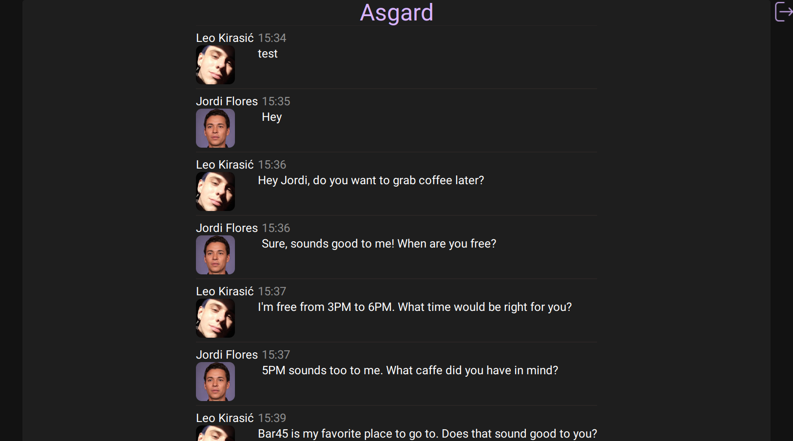

<div align="center">
        
   # Asgard
        
   Photo Tagging Application inspired by Where's Wally.
        
   [Live Demo](https://asgard-2f1b5.web.app/) •
   [Installation](#installation) •
   [Technologies](#technologies)
  [](https://github.com/LeoKirasic/asgard)

</div>

<div align="left">
        
# Installation
        
```
git clone https://github.com/LeoKirasic/asgard.git
cd asgard
npm install
npm run build
firebase deploy
```
</div>


<div align="left">
        
# Technologies
- [Typescript](https://www.typescriptlang.org/)
- [React](https://github.com/facebook/react)
- [React Router](https://github.com/remix-run/react-router)
- [TailwindCSS](https://github.com/tailwindlabs/tailwindcss)
- [Firebase](https://firebase.google.com/)
- [Create React App](https://github.com/facebook/create-react-app/)

</div>

<div align="left">
 
# Reflections
        
Chat Application built with React, Typescript and Firebase. One of my favorite projects! It was challenging and fun at the same time learning about private routes, authentication, loading messages and user information in real time. The Application is built with a mobile first approach and is completely responsive! 
        
</div>
